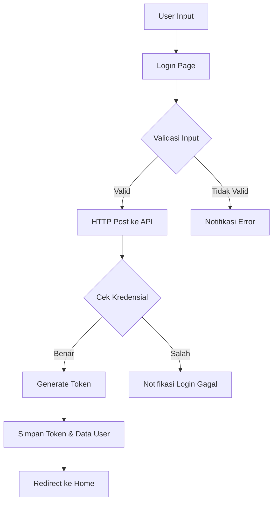
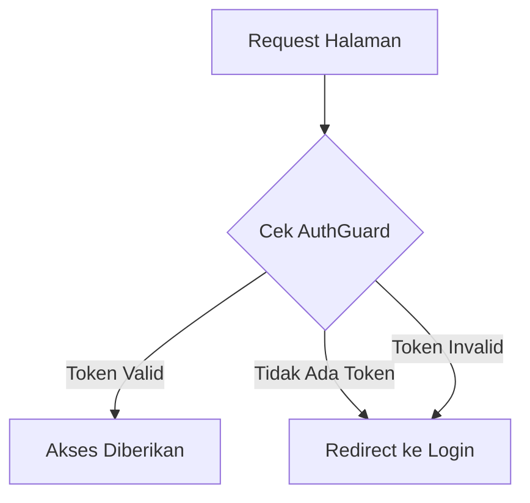

# Cara Kerja Sistem Login Ionic

## Komponen Utama
1. **Service Authentication**
   - Berperan sebagai pengelola utama proses autentikasi
   - Menyimpan dan mengelola status login
   - Menangani penyimpanan dan pembacaan token
   - Mengatur komunikasi dengan API

2. **Guard System**
   - AuthGuard: Memeriksa status autentikasi sebelum mengakses halaman terproteksi
   - AutoLoginGuard: Menangani proses login otomatis jika sudah ada data tersimpan

3. **API Backend**
   - Menangani validasi kredensial pengguna
   - Menghasilkan token untuk sesi login
   - Berkomunikasi dengan database

## Alur Proses Login

### 1. Inisialisasi Aplikasi
- Aplikasi melakukan pemeriksaan token yang tersimpan di Preferences
- AuthenticationService memuat data tersimpan melalui `loadData()`
- Status autentikasi diatur dalam `BehaviorSubject`

### 2. Proses Login Manual

1. **Input Pengguna**
   - User memasukkan username dan password
   - Sistem melakukan validasi input tidak boleh kosong

2. **Pengiriman Data**
   - Data dikirim ke API menggunakan HTTP POST
   - Format data: `{ username: string, password: string }`

3. **Proses di Backend**
   - API menerima dan memvalidasi data
   - Password di-hash menggunakan MD5
   - Melakukan pengecekan ke database
   - Menghasilkan token jika valid

4. **Respons Backend**
   - Sukses: Mengirim data `{ username, token, status_login: "berhasil" }`
   - Gagal: Mengirim `{ status_login: "gagal" }`

5. **Penanganan Respons**
   - Jika sukses:
     - Token disimpan di Preferences
     - Status autentikasi diperbarui
     - Navigasi ke halaman home
   - Jika gagal:
     - Menampilkan notifikasi error
     - Tetap di halaman login

### 3. Proses Autorisasi

1. **Pemeriksaan Route**
   - Setiap akses ke halaman terproteksi melewati AuthGuard
   - Guard memeriksa status autentikasi via AuthenticationService

2. **Validasi Status**
   - Jika terotentikasi: Akses diberikan
   - Jika tidak: Redirect ke halaman login

### 4. Proses Logout

1. **Inisiasi Logout**
   - User memilih opsi logout
   - Memanggil method `logout()` dari AuthenticationService

2. **Pembersihan Data**
   - Token dihapus dari Preferences
   - Status autentikasi di-reset
   - Navigasi kembali ke halaman login

## Penyimpanan Data

1. **Token Storage**
   - Menggunakan Capacitor Preferences
   - Menyimpan token dengan key 'auth-login'
   - Menyimpan data user dengan key 'auth-user'

2. **State Management**
   - Menggunakan RxJS BehaviorSubject untuk status autentikasi
   - Memungkinkan reactive updates ke komponen yang berlangganan

## Keamanan
- Validasi input di frontend
- Hash password di backend
- Token-based authentication
- Proteksi route menggunakan Guards
- Header CORS untuk keamanan API

## Screenshots

